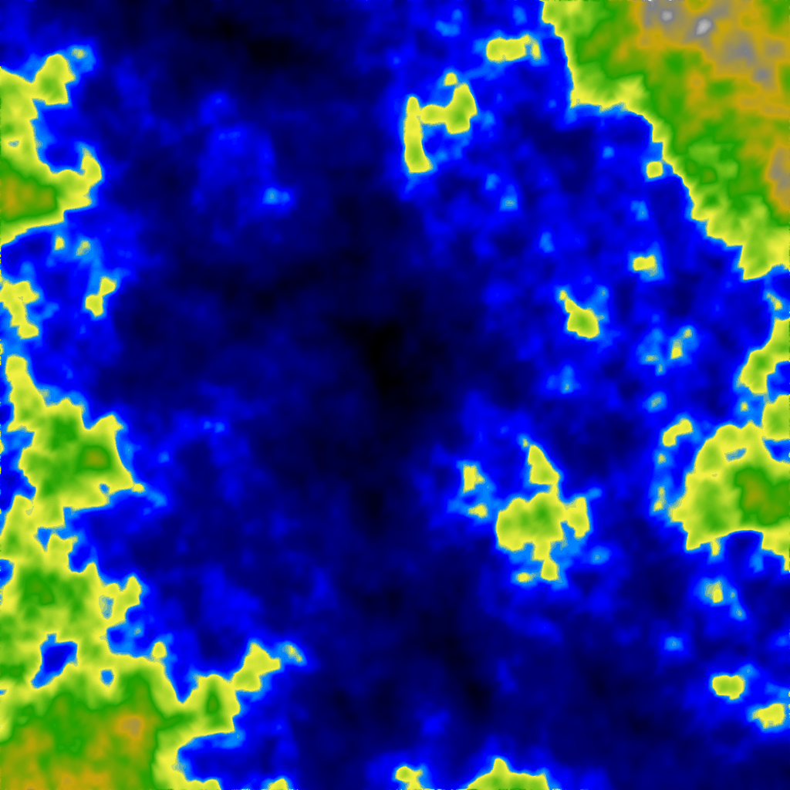
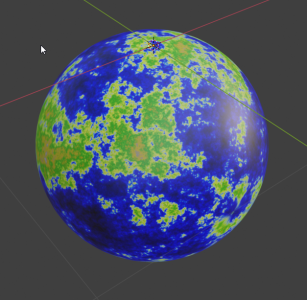

# Openktt project

Video game concept that merge openttd, rise of industry and cities skylines.

## Current status

### Heightmap generation

#### 2D

#### 3D (Not working)

x axis liked

#### 4D

x and y axis linked

#### Spherical

##### Using godot

Same texture with a sphere:  
  
Same texture with a sphere and clouds (with shaders):
